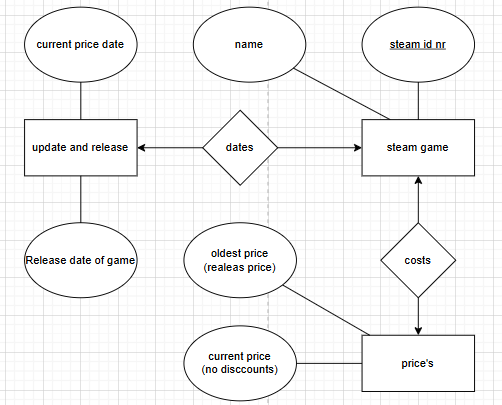

# Steam Prices

This project uses data from https://steamdb.info/ to display stats about games. In particular showing the prices and dates from release and now.

## E/R Diagram

##  Prerequisites

Both types of os requires a Python and PostgreSQL installation

### Linux

It is recommneded that PostgresSQL has a user named postgres with password 'admin'. Additionally following postgres setting are recommended to reduce the amount of password prompts.

Profile in pg_hba.conf:
local   all             postgres                                trust

### Windows

It is required to use a bash terminal, as all the scripting requires it.

## Compile / How To Run

Simply type the following commands:

chmod +x ./first_time_setup.sh
source first_time_setup.sh

Doing the setup there will be many password prompts. Every single time enter your password for your user named 'postgres'.

Lastly you will see flask saying the website is hosted on localhost port 5000. Open this address in your webbrowser and you will be taken to the project website.

## Browsing

Upon opening the website you land on the homepage. Click on "click here" to enter the steam game statistics page. Here you can see a collection of steam games and information about them. There is filtering options, which use regular expressions, to filter certain games by chosen condition.